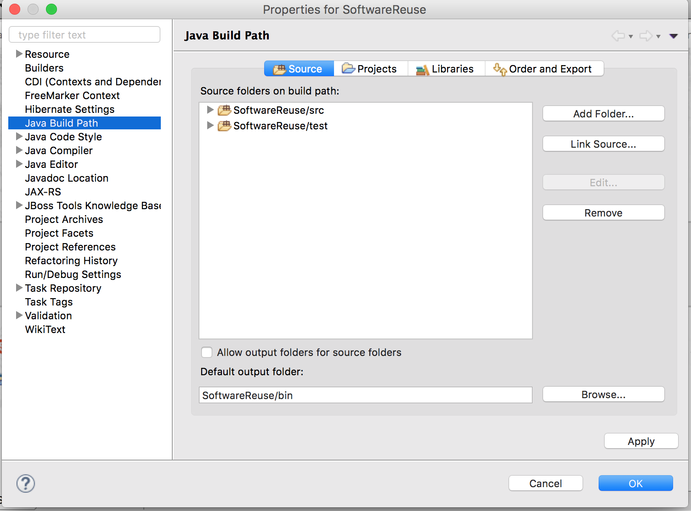
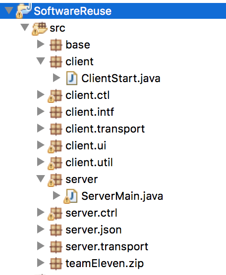
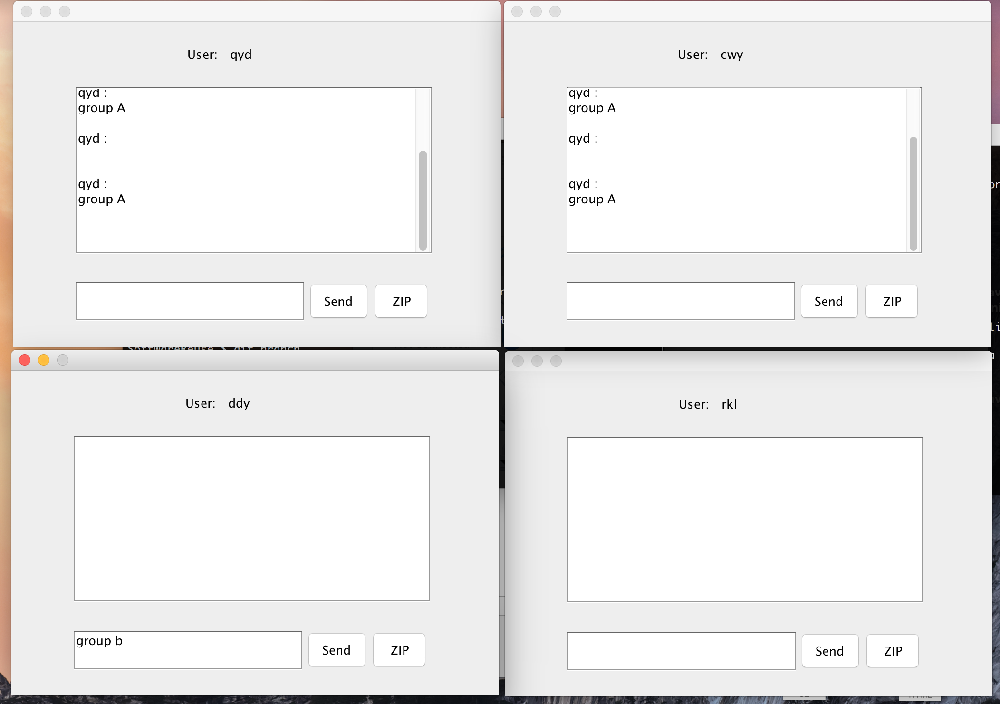
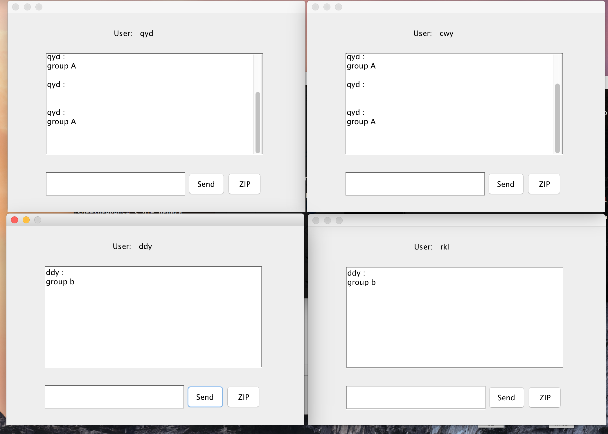

# SoftwareReuse-Project

##说明
+ 项目采用Eclipse开发，使用socket进行通信。
+ 项目业务代码位于src文件夹下，项目测试代码位于test文件夹下，请确保把这两个文件夹都加入到 Java build path 中去。

+ 客户端入口为client包下ClientStart类的main方法，服务端入口为server包下ServerMain类的main方法。客户端登陆前要先启动服务端。

+ 因为没有注册功能，所以用户是由后台设置的。用户名分别为qyd、cwy、ddy、rkl，密码均为111。其中qyd和cwy是一组，ddy和rkl是一组。

+ 程序运行示例

+ 文档在doc文件夹下
+ 讨论课内容在discussion文件夹下
+ jar包(可复用构件）在release文件夹中

##2016T11
####Members: 
1251368  代东洋  [DaiDongyang](https://github.com/daidongyang) 
1252865  秦乙丹  [rzchar](https://github.com/rzchar) 
1252874  陈薇伊  [WeiyiChen](https://github.com/weiyichen) 
1252899  阮康乐  [rkl1994](https://github.com/rkl1994)

