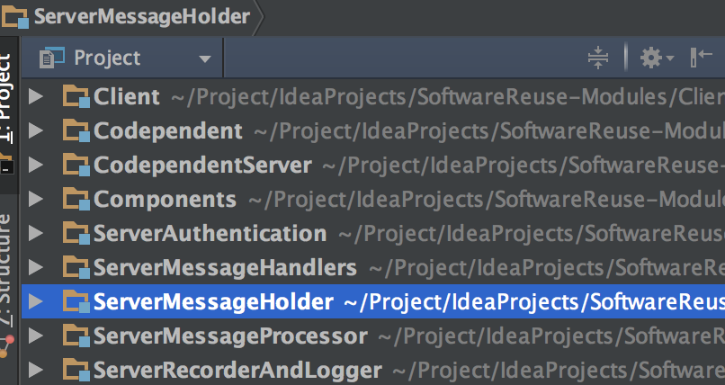
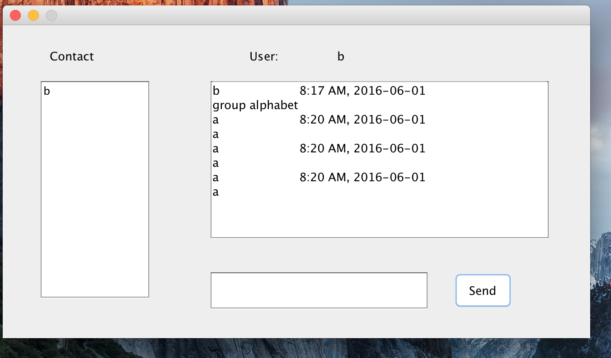
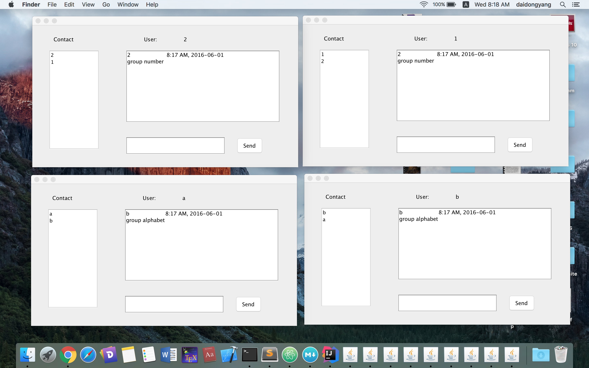
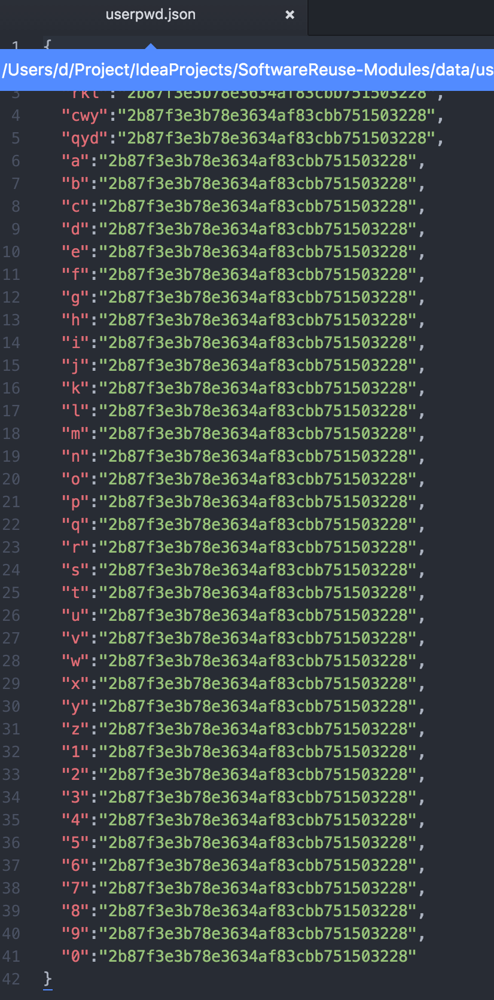
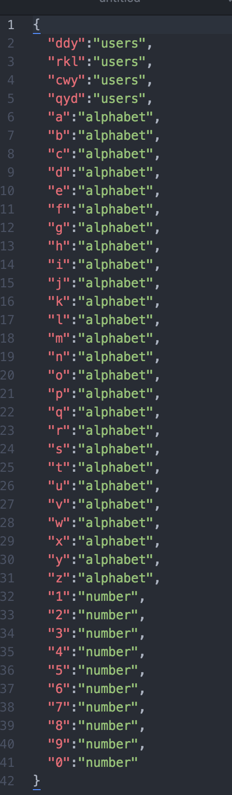

# SoftwareReuse-Project
##项目说明
+ 项目采用Intellij Idea开发，服务端与客户端之间使用Socket进行通信，服务端各模块之间采用Java RMI技术相互调用。
+ 项目（Project) 下有9个模块(module)，其中服务端分为功能相互独立的5个模块，如下图。

	
	+ Codependent模块是客户端与服务端之间共用的代码。
	+ CodependentServer模块是服务端各个模块之间共用的代码。
	+ Componets模块是本组开发的一些构件的源代码。
	+ Client模块指客户端。
	+ ServerAuthentication模块负责用户认证（验证密码）的相关业务。
	+ ServerMessageHandlers模块负责服务端收发消息的相关业务。
	+ ServerMessageHolder模块负责消息存储，以及用户离线应接受消息的相关存储，控制业务（使用户接受不在线时消息的相关业务代码）。
	+ ServerMessageProcessor模块负责消息的转发，License业务。
	+ ServerRecorderAndLogger模块负责PM、log业务，以及相应的打包业务。

+ 为保证项目正常运行，请把Components模块、Codependent模块的代码加入到客户端、服务端各模块的classpath中，把CodependentServer模块的代码添加到服务端各模块的classpath中。另外，也要把项目根目录下lib文件夹下的各个jar包加入到各个模块的classpath中。
+ 服务端各模块的程序入口在XXXEntry类中，客户端程序入口在ClientStart类中，在客户端用户登录之前，请确保服务端五个模块已经启动。另外，ServerMessageProcessor模块在启动时，会调用ServerMessageHolder模块的接口进行初始化工作，因此请确保ServerMessageHolder模块在ServerMessageProcessor模块之前启动。
+ 项目根目录下data文件夹下config.json文件为服务端的配置文件。若遇到端口占用等问题，请改变配置文件中的端口号，重新启动。
+ 程序运行示例

##用户密码及分组说明
+ 用户密码的相关信息保存在项目根目录下data文件夹userpwd.json中，其中密码采用md5加密，默认密码为111。如下图：

 

+ 用户分组信息相关信息保存在项目根目录下data文件夹usergroup.json中，如下图

##其他
+ 文档在doc文件夹下
+ 讨论课内容在discussion文件夹下
+ jar包(可复用构件）在release文件夹中

##2016T11
####Members: 
1251368  代东洋  [DaiDongyang](https://github.com/daidongyang) 
1252865  秦乙丹  [rzchar](https://github.com/rzchar) 
1252874  陈薇伊  [WeiyiChen](https://github.com/weiyichen) 
1252899  阮康乐  [rkl1994](https://github.com/rkl1994)

